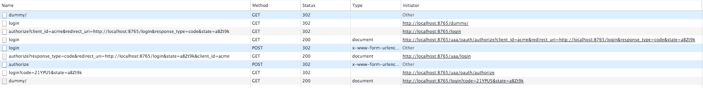

# UAA (`AuthorizationServer`) load balanced behind API-GATEWAY (Edge service `Zuul`)

## Disclamer

**This project is *Proof of concept* (aka `PoC`)** (and code quality is not perfect), please before using in production review security concerns among other things. (See https://github.com/kakawait/uaa-behind-zuul-sample/issues/6)

## Change Log

see [CHANGELOG.md](CHANGELOG.md)

## Overview

Quick&dirty sample to expose how to configure `AuthorizationServer` (*UAA*) behind `Zuul`

This way to do may not work for all kind of configuration (I do not test without `JWT` and `prefer-token-info: true`)

## Usage

Please deploy every services using [*docker way*](#docker) or [*maven way*](#maven), then simply load `http://localhost:8765/dummy` on your favorite browser.

Default user/password is `user/password`

### Docker

Start building docker images for every services, simply run following command on root directory

```shell
mvn clean package -Pdocker
```

Launch services using `docker-compose`

```shell
docker-compose up -d
```

### Maven

On each service folder run following command:

```sh
mvn spring-boot:run
```

## Run

Open http://localhost:8765/dummy and connect with:

- user: user
- password: password

## Goals

1. Avoid any absolute/hardcoded urls for `security.oauth2.client.accessTokenUri` & `security.oauth2.client.userAuthorizationUri` in order to improve portability!
2. `AuthorizationServer` distribution for HA
3. Do not expose `AuthorizationServer`, like other *service* `AuthorizationServer` will be behind `Zuul`



Where `localhost:8765` is `Zuul`, as you can see `AuthorizationServer` is not leaked outside! Only `Zuul` is targeted.

**ATTENTION** for **2.** you should manage yourself shared storage backend (unlike following sample)! Using database or something els.

## Keys points of the sample

### [`Zuul`] Custom `OAuth2ClientContextFilter`

I had to override [`OAuth2ClientContextFilter`](https://github.com/spring-projects/spring-security-oauth/blob/master/spring-security-oauth2/src/main/java/org/springframework/security/oauth2/client/filter/OAuth2ClientContextFilter.java) to support `URI` and not only `URL` (see `DynamicOauth2ClientContextFilter`).
Indeed `URL` does not support path like `/uaa/oauth/authorize`.

Why adding path support on `OAuth2ClientContextFilter`?

Because I want to use path on `security.oauth2.client.userAuthorizationUri` in order to redirect user to `Zuul` itself.

On this case I can't use `http://localhost:${server.port}/uaa/oauth/authorize` because `security.oauth2.client.userAuthorizationUri` is use on web redirection (header `Location: `).

Flow will look like following

```
Browser                             Zuul                               UAA
   │        /dummy                   │                                  │
   ├────────────────────────────────>│                                  │
   │  Location:http://ZUUL/login     │                                  │
   │<┄┄┄┄┄┄┄┄┄┄┄┄┄┄┄┄┄┄┄┄┄┄┄┄┄┄┄┄┄┄┄┄┤                                  │
   │        /login                   │                                  │
   ├────────────────────────────────>│                                  │
   │  Location:/uaa/oauth/authorize  │                                  │
   │<┄┄┄┄┄┄┄┄┄┄┄┄┄┄┄┄┄┄┄┄┄┄┄┄┄┄┄┄┄┄┄┄┤                                  │
   │     /uaa/oauth/authorize        │                                  │
   ├────────────────────────────────>│                                  │
   │                                 │      /uaa/oauth/authorize        │
   │                                 ├┄┄┄┄┄┄┄┄┄┄┄┄┄┄┄┄┄┄┄┄┄┄┄┄┄┄┄┄┄┄┄┄┄>│
   │                                 │                                  ├──┐
   │                                 │                                  │  │ Not authorize
   │                                 │                                  │<─┘
   │                                 │  Location:http://ZUUL/uaa/login  │
   │                                 │<┄┄┄┄┄┄┄┄┄┄┄┄┄┄┄┄┄┄┄┄┄┄┄┄┄┄┄┄┄┄┄┄┄┤
   │                                 │                                  │
   │ Location:http://ZUUL/uaa/login  │                                  │
   │<┄┄┄┄┄┄┄┄┄┄┄┄┄┄┄┄┄┄┄┄┄┄┄┄┄┄┄┄┄┄┄┄┤                                  │
   │       /uaa/login                │                                  │
   ├────────────────────────────────>│                                  │
   │                                 │            /uaa/login            │
   │                                 ├┄┄┄┄┄┄┄┄┄┄┄┄┄┄┄┄┄┄┄┄┄┄┄┄┄┄┄┄┄┄┄┄┄>│
   │                                 │           LOGIN FORM             │
   │                                 │<┄┄┄┄┄┄┄┄┄┄┄┄┄┄┄┄┄┄┄┄┄┄┄┄┄┄┄┄┄┄┄┄┄┤
   │           LOGIN FORM            │                                  │
   │<────────────────────────────────┤                                  │
```

Take attention on second redirection, location is using path (not at browser level).

### [`Zuul`] `localhost` trick for `security.oauth2.client.accessTokenUri`

Unlike `security.oauth2.client.userAuthorizationUri`, `security.oauth2.client.accessTokenUri` is not used a browser level for redirection but used by `RestTemplate`.
However default `RestTemplate` used for `accessTokenUri` is not _load balanced_ thus we can't use url like http://service-name/oauth/token.

We can simply add _load balanced_ feature by adding such `Bean`

```java
@Bean
UserInfoRestTemplateCustomizer userInfoRestTemplateCustomizer(SpringClientFactory springClientFactory) {
    return template -> {
        AccessTokenProviderChain accessTokenProviderChain = Stream
                .of(new AuthorizationCodeAccessTokenProvider(), new ImplicitAccessTokenProvider(),
                        new ResourceOwnerPasswordAccessTokenProvider(), new ClientCredentialsAccessTokenProvider())
                .peek(tp -> tp.setRequestFactory(new RibbonClientHttpRequestFactory(springClientFactory)))
                .collect(Collectors.collectingAndThen(Collectors.toList(), AccessTokenProviderChain::new));
        template.setAccessTokenProvider(accessTokenProviderChain);
    };
}
```

An opened isse exists https://github.com/spring-projects/spring-security-oauth/issues/671

### [`Zuul`] Clear `sensitiveHeaders` lists for `AuthorizationServer` route

Since `Brixton.RC1`, `Zuul` filters some headers (http://cloud.spring.io/spring-cloud-static/spring-cloud.html#_cookies_and_sensitive_headers).

By default it filters:

- `Cookie`
- `Set-Cookie`
- `Authorization`

But we need that `AuthorizationServer` could create cookies so we must clear list

```yml
zuul:
  routes:
    uaa-service:
      sensitiveHeaders:
      path: /uaa/**
      stripPrefix: false
```

**TODO** Check if `zuul.routes.uaa-service.sensitiveHeaders: Authorization` could work?

### [`Zuul`] Disable `XSRF` at gateway level for `AuthorizationServer`

`AuthorizationServer` has it own `XSRF` protection so we must disable at `Zuul` level

```java
private RequestMatcher csrfRequestMatcher() {
    return new RequestMatcher() {
        // Always allow the HTTP GET method
        private final Pattern allowedMethods = Pattern.compile("^(GET|HEAD|OPTIONS|TRACE)$");

        // Disable CSFR protection on the following urls:
        private final AntPathRequestMatcher[] requestMatchers = { new AntPathRequestMatcher("/uaa/**") };

        @Override
        public boolean matches(HttpServletRequest request) {
            if (allowedMethods.matcher(request.getMethod()).matches()) {
                return false;
            }

            for (AntPathRequestMatcher matcher : requestMatchers) {
                if (matcher.matches(request)) {
                    return false;
                }
            }
            return true;
        }
    };
}
```

### [`Zuul`] Authorize request to `AuthorizationServer`

Ok should I really need to explain why?

```java
http.authorizeRequests().antMatchers("/uaa/**", "/login").permitAll()
```

**ATTENTION** do not use `"/uaa/**"` authorize only necessary API (I was to lazy)

### [`UAA`] Deploy `AuthorizationServer` on isolated `context-path`

`Zuul` and `AuthorizationServer` have to manage their own session! So both have to write two `JSESSIONID` cookies.

You must isolate `AuthorizationServer` on other context-path `server.context-path = /uaa` to avoid any cookies collision.

**ALTERNATIVE** we can check if `server.session.cookie.path` or `server.session.cookie.name` is not sufficient, I did not test it.

### [`UAA`] Enable `server.use-forward-headers`

Does not work without. I will not explain why, please look about `X-Forwarded-*` headers for more information.

